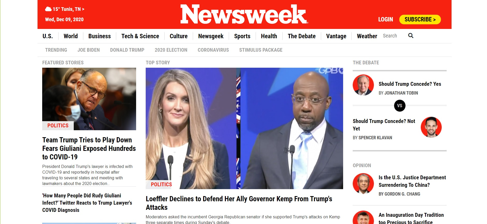

# Newsweek-clone-project

> We re-created the web page of The Newsweek 

This is second week Microverse project we implemented it using the positioning and flexbox concepts
## Built With

- HTML
- CSS
- SASS
- BootStrap
- VS Code 

## Live Demo

[Live Demo Link](https://aymenbida.github.io/Newsweek-clone-project/)

## Getting Started

To get a local copy up and running follow these simple example steps.

### Prerequisites

A machine with a working and up to date web browser.

### Setup

- Clone the repository to your folder of choice using Git (or just download all the files)
- Open the index.html file (in the root folder) and the website should show up.

## Authors

👤 **Author1**

- GitHub: [@AymenBida](https://github.com/AymenBida)

👤 **Author2**

- GitHub: [@FrederickMih](https://github.com/FrederickMih)

## 🤝 Contributing

Contributions, issues, and feature requests are welcome!

Feel free to check the [issues page](issues/).

## Show your support

Give a ⭐️ if you like this project!

## Acknowledgments

- Thank you Microverse to giving us this chance to learn :)

## 📝 License

This project is [MIT](lic.url) licensed.
